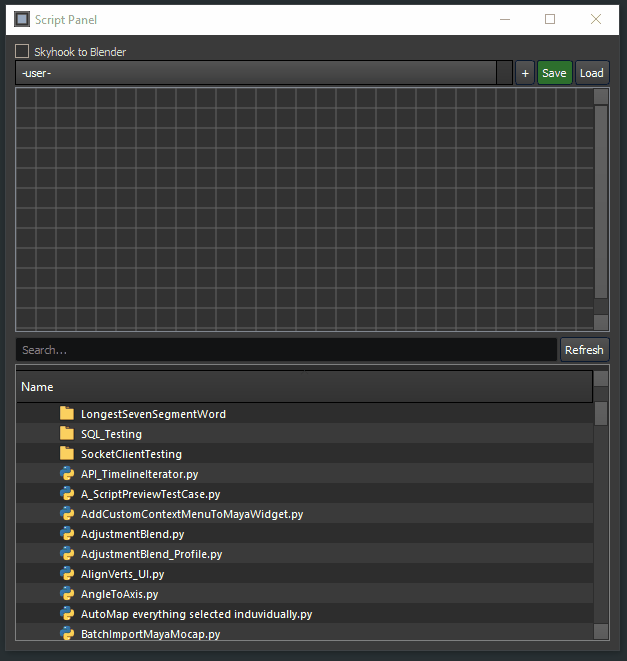

# Script Panel
User customizable palette of scripts

# Install

<pre>
1. Download this package and unzip it in a good location 
    1.B (or git clone it directly if you have git installed)
2. Run installer.bat (will walk you through some options for install)
3. Restart Maya (or run start_standalone.bat)
</pre>

# Start the tool
1. Run this script in a python tab in maya

<pre>

import script_panel
script_panel.main()

</pre>

# Developing
If you want to reload the code when developing, you can execute
<pre>script_panel.main(reload=True)</pre>

